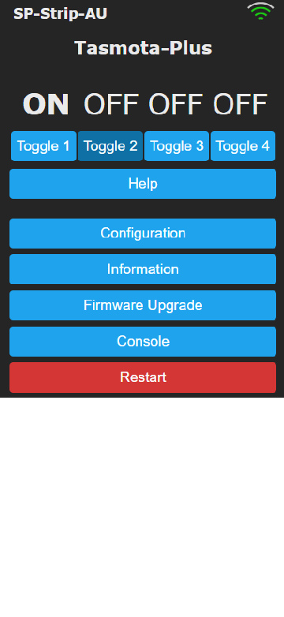

# Tasmota Plus
[UBWH](https://ubwh.com.au) has developed an enhanced version of [Tasmota](https://tasmota.github.io/docs/ "Tasmota") with additional features making it better suited for use by IT professionals.

## Why Tasmota?
[Internet of Things](https://en.wikipedia.org/wiki/Internet_of_things "IoT") (IoT) devices are Internet-connected smart appliances. 

Unfortunately, many IoT devices are controlled via a cloud server; commonly in China. Also, there is generally no way to control these devices using remote commands from (e.g.) a PHP script running on a separate computer.

Tasmota devices work differently; they are controlled via
1. the built-in Web server [GUI](https://en.wikipedia.org/wiki/Graphical_user_interface)
1. http URLs: e.g. [http://_My.IP.Address.com_/cm?cmnd=Power On]()
1. [MQTT]()
1. [openHAB]()
1. [Many others...](https://tasmota.github.io/docs/Integrations/)
  
## Why Tasmota Plus?
This table summarises the differences between normal **Tasmota** and **Tasmota Plus**.

| Feature                        | Tasmota Standard | Tasmota Plus |       
| :------------------------------|:------------:|:------:|
|[WAN Security](#wan-security)|❌|✔️|
|[Clock config page](#clock-config-page)|❌|✔️|
|[Ping command](#ping-command)|❌|✔️|
|[Ping watchdogs](#ping-watchdogs)|❌|✔️|
|[WiFi signal strength indicator](#wifi-signal-strength-indicator)|❌|✔️|
|Works with [MQTT](https://mqtt.org/)|✔️|✔️|
|Works with [Domoticz](https://www.domoticz.com/)|✔️|✔️|

➕ = Enhanced

## Tasmota Plus Features

### WAN security ###  

Prevent commands being executed unless coming from a nominated IP address.

### Clock Config Page ###

Allowing setting of parameters (Time zone, Daylight saving, ...) so that the Real Time Clock is accurate.

### Ping Command ###

Commands such as ping 8.8.8.8 can be issued from the Console command line. 
See [Tasmota Ping command](https://tasmota.github.io/docs/Commands/#ping) for more information.

### Ping Watchdogs ###

Enabling cycling of socket power if pings to a nominated IP address fail.

### WiFi signal strength indicator ###

Visualisation of the WiFi signal strength as seen by the Tasmota device.

With _Tasmota Standard_, WiFi signal level is only available in the _Information_ page. 

## Products Available with Tasmota Plus

| Part Number     | [SP-Plug-AU](https://ubwh.com.au/SP-Plug-AU) | [SP-Strip-AU](https://ubwh.com.au/SP-Strip-AU)       
| :---------------|:------------:|:--------: 
| Image | |
|Description | A single-outlet, voltage and power monitoring Australian Smart Plug.|A 4-outlet Australian Smart Power Strip. 
| Main page||
| User Guide|[User Guide](assets/guides/USG-SP-Plus.pdf)|[User Guide](assets/guides/USG-SP-Strip.pdf)
| Firmware URL | http://ubwh.com.au/tasmota/SP-Plug-AU/tasmota.bin.gz | http://ubwh.com.au/tasmota/SP-Strip-AU/tasmota.bin.gz

## Firmware Upgrade Instructions
There are two ways to upgrade the firmware: 
1. __Over the Air (OTA)__
* Open the Main page of your Tasmota-Plus device
* Click __Firmware Upgrade__
* In the _OTA Url_ box enter the _Firmware URL_ for you device (see above)
* Click _Start upgrade_
* Your device will:
  * Download the firmware file
  * Install it
  * Reboot
* Your device will NOT:
  * Change the Settings (i.e. Configuration)
2. __Upload file__
* With your local computer: Visit the _Firmware URL_ for your device (see above)
* Download and save the file
* Open the Main page of your Tasmota-Plus device
* Click __Firmware Upgrade__
* Click __Choose file__
* Select the file just downloaded
* Click __Start upgrade__

## Firmware Upgrade Instructions2
## Firmware Upgrade Instructions3
## Firmware Upgrade Instructions4

